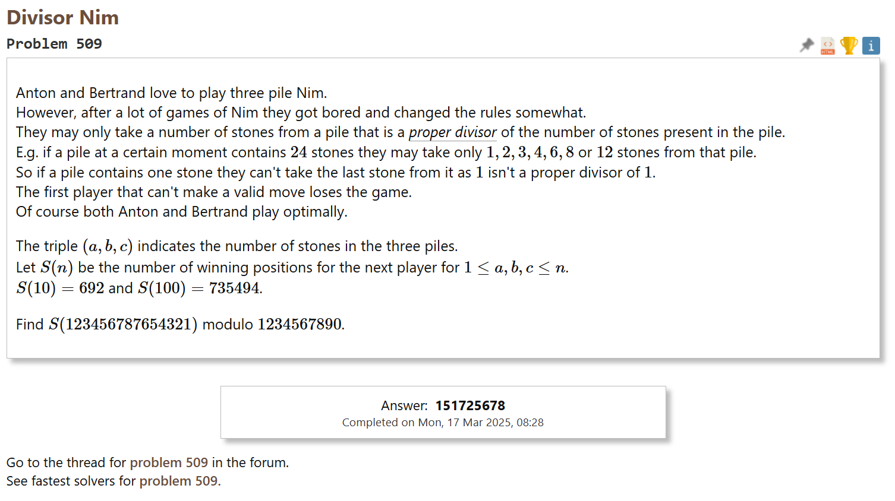

# Project Euler Solutions

This repository contains my solutions to selected problems from [Project Euler](https://projecteuler.net/), a series of challenging mathematical/computer programming problems.

## 🎯 Problems Solved

### ✅ Problem 62: Cubic Permutations
- **Status**: Completed
- **Solution**: [`projecteuler62.py`](projecteuler62.py)
- **Verification**: 
  

### ⏳ Problem 312: Cyclic Paths
- **Status**: In Progress
- **Implementation**: [`projecteuler312.py`](projecteuler312.py)
- **Current Focus**: Optimizing algorithm for large numbers

### ✅ Problem 509: Divisor Game
- **Status**: Completed
- **Solution**: [`projecteuler509.py`](projecteuler509.py)
- **Verification**:
  

## 🛠️ Implementation Details

### Technology Stack
- **Language**: Python 3

### Code Quality Focus
- Efficient algorithmic implementations
- Clean, documented code
- Mathematical optimization techniques
- Type hinting and error handling

## 🚀 Running the Solutions

```bash
# Run individual solutions
python projecteuler62.py
python projecteuler312.py
python projecteuler509.py
```

## 📚 About Project Euler

[Project Euler](https://projecteuler.net/) offers a unique platform that combines mathematics with programming. The problems require creative problem-solving approaches, making them excellent exercises for both mathematical thinking and coding skills.

## 🔗 Links

- [Project Euler Homepage](https://projecteuler.net/)
- [Problem 62](https://projecteuler.net/problem=62)
- [Problem 312](https://projecteuler.net/problem=312)
- [Problem 509](https://projecteuler.net/problem=509)